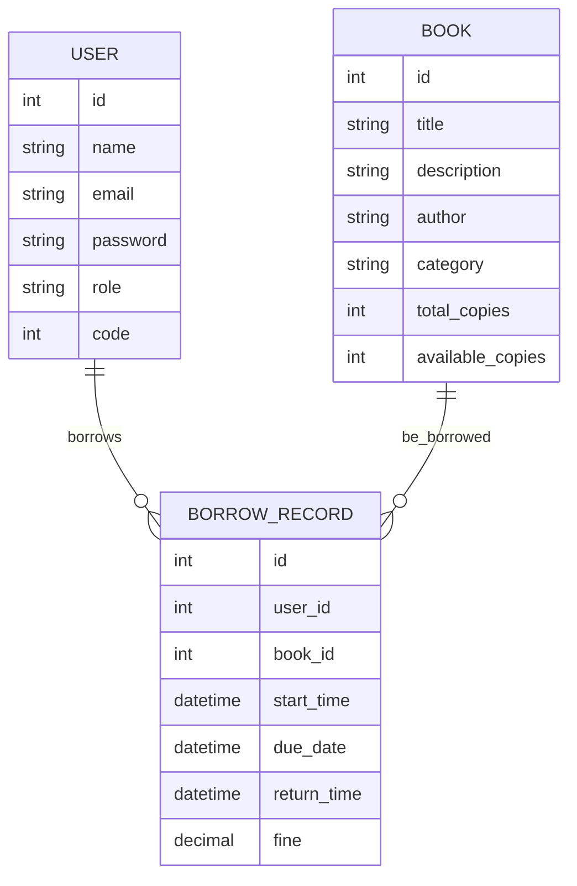

```mermaid
erDiagram
    USER {
        int id
        string name
        string email
        string password
        string role
        int code
    }

    BOOK {
        int id
        string title
        string description
        string author
        string category
        int total_copies
        int available_copies
    }

    BORROW_RECORD {
        int id
        int user_id
        int book_id
        datetime start_time
        datetime due_date
        datetime return_time
        decimal fine
    }

    USER ||--o{ BORROW_RECORD : borrows
    BOOK ||--o{ BORROW_RECORD : be_borrowed


```