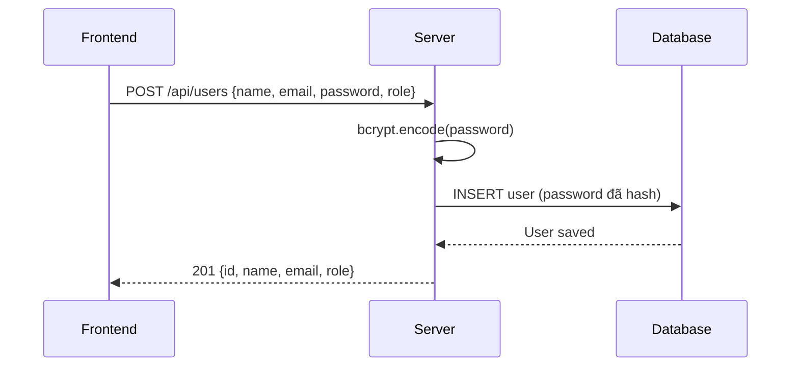
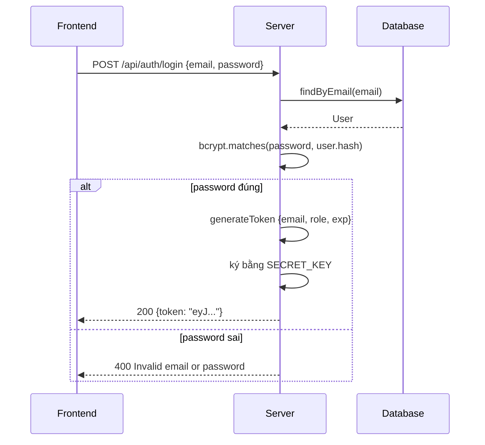
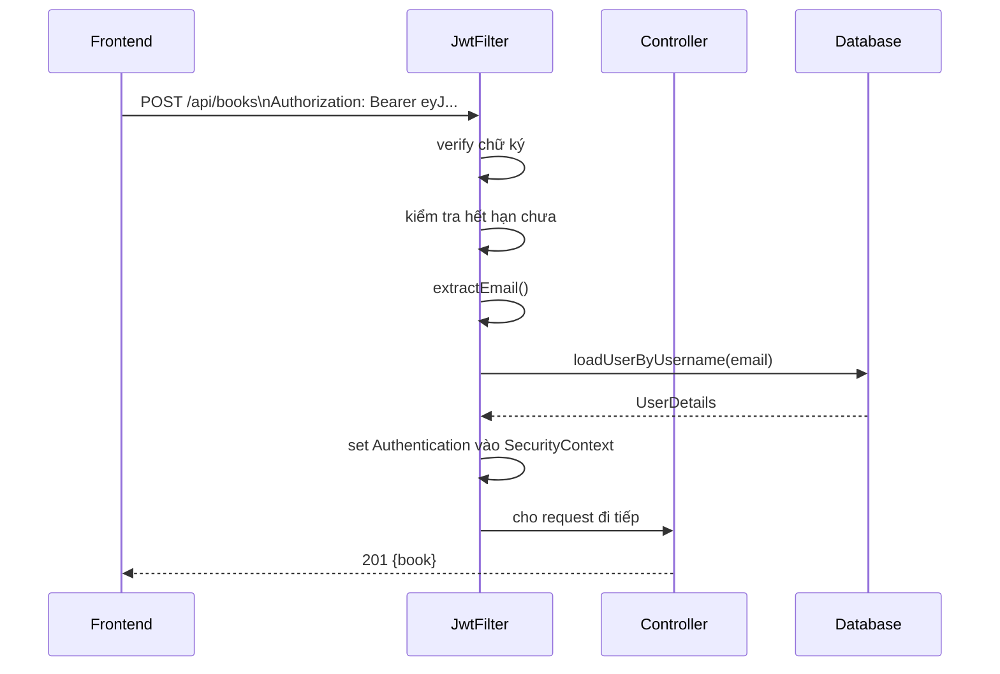
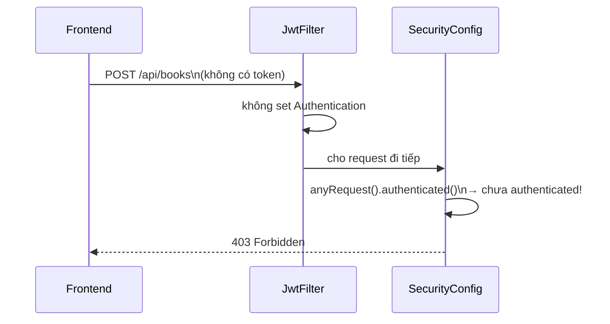

# JWT Authentication Flow

## 1. Tạo User

```mermaid
sequenceDiagram
    participant F as Frontend
    participant S as Server
    participant D as Database

    F->>S: POST /api/users {name, email, password, role}
    S->>S: bcrypt.encode(password)
    S->>D: INSERT user (password đã hash)
    D-->>S: User saved
    S-->>F: 201 {id, name, email, role}
```

## 2. Đăng nhập

```mermaid
sequenceDiagram
    participant F as Frontend
    participant S as Server
    participant D as Database

    F->>S: POST /api/auth/login {email, password}
    S->>D: findByEmail(email)
    D-->>S: User
    S->>S: bcrypt.matches(password, user.hash)
    alt password đúng
        S->>S: generateToken {email, role, exp}
        S->>S: ký bằng SECRET_KEY
        S-->>F: 200 {token: "eyJ..."}
    else password sai
        S-->>F: 400 Invalid email or password
    end
```

## 3. Gọi API có xác thực

```mermaid
sequenceDiagram
    participant F as Frontend
    participant JF as JwtFilter
    participant C as Controller
    participant D as Database

    F->>JF: POST /api/books\nAuthorization: Bearer eyJ...
    JF->>JF: verify chữ ký
    JF->>JF: kiểm tra hết hạn chưa
    JF->>JF: extractEmail()
    JF->>D: loadUserByUsername(email)
    D-->>JF: UserDetails
    JF->>JF: set Authentication vào SecurityContext
    JF->>C: cho request đi tiếp
    C-->>F: 201 {book}
```

## 4. Gọi API không có token

```mermaid
sequenceDiagram
    participant F as Frontend
    participant JF as JwtFilter
    participant SC as SecurityConfig

    F->>JF: POST /api/books\n(không có token)
    JF->>JF: không set Authentication
    JF->>SC: cho request đi tiếp
    SC->>SC: anyRequest().authenticated()\n→ chưa authenticated!
    SC-->>F: 403 Forbidden
```
